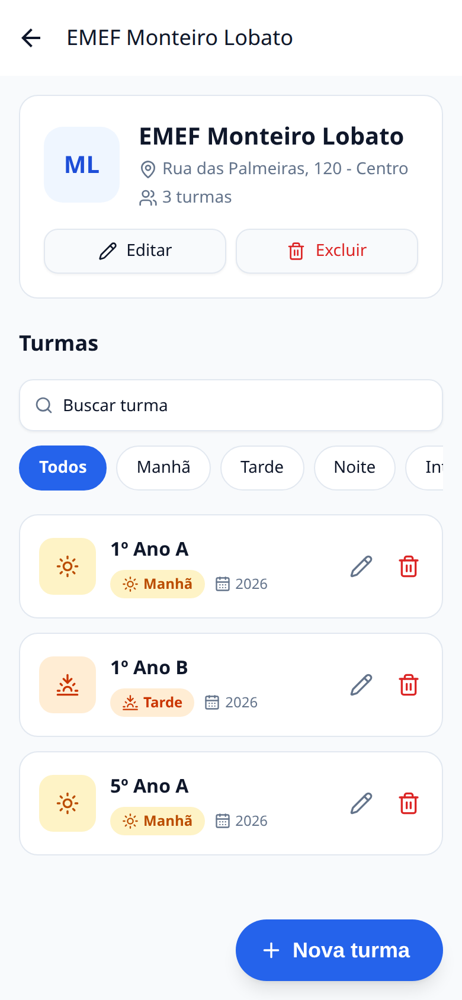
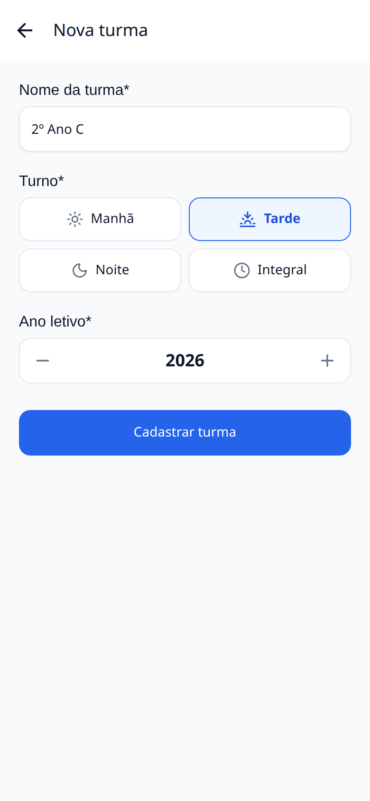
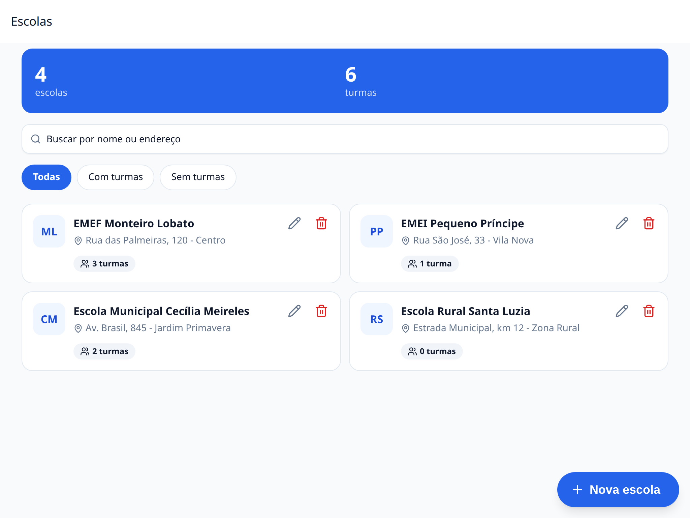

# Prefeitura – Escolas e Turmas

Aplicativo mobile (Android/iOS) para a prefeitura centralizar o cadastro das **escolas públicas** e de suas **turmas**, substituindo o controle manual em planilhas.

Feito com **Expo SDK 57 + React Native 0.86 + TypeScript**, navegação com **Expo Router**, UI com **Gluestack UI**, estado com **Zustand** e back-end simulado com **MirageJS**.

|                            Escolas                            |                         Detalhe da escola                          |                        Nova turma                         |
| :-----------------------------------------------------------: | :----------------------------------------------------------------: | :-------------------------------------------------------: |
|         |        |  |
|                     **Feedback de ações**                     |                  **Tema escuro, busca e filtro**                   |                                                           |
|  |  |                                                           |

<details>
<summary>Layout em tablet (grade de 2 colunas)</summary>


</details>

---

## Sumário

- [Funcionalidades](#funcionalidades)
- [Versões utilizadas](#versões-utilizadas)
- [Instalação e execução](#instalação-e-execução)
- [Back-end simulado (MirageJS)](#back-end-simulado-miragejs)
- [Scripts](#scripts)
- [Testes](#testes)
- [Arquitetura](#arquitetura)
- [Decisões técnicas](#decisões-técnicas)

## Funcionalidades

**Escolas**

- Listagem com nome, endereço e número de turmas, além do total de escolas e turmas.
- Cadastro (nome e endereço obrigatórios), edição e exclusão com confirmação. A exclusão avisa que as turmas da escola também serão removidas.

**Turmas**

- Listagem das turmas da escola selecionada.
- Cadastro com nome, turno (manhã, tarde, noite ou integral) e ano letivo, além de edição e exclusão com confirmação.

**Extras**

- Busca sem distinção de acentos ("cecilia" encontra "Cecília") e filtros: escolas com ou sem turmas; turmas por turno.
- Layout responsivo: 1 coluna no celular, 2 no tablet e 3 em telas largas. Formulários ficam com largura legível no tablet.
- Tema claro e escuro, seguindo o sistema.
- Armazenamento offline com AsyncStorage: os dados já carregados continuam disponíveis sem rede, e o banco do mock é persistido entre execuções.
- Estados de carregamento (skeleton), vazio, erro com "Tentar novamente" e puxar para atualizar.
- Validação nos campos, erros do servidor exibidos no campo correspondente e avisos de sucesso ou erro.
- Acessibilidade: rótulos em campos e botões, seletor de turno como grupo de opções e seletor de ano ajustável por leitor de tela.
- Hooks personalizados, componentização por feature e testes unitários e de integração.

## Versões utilizadas

| Ferramenta / biblioteca      | Versão                                                          |
| ---------------------------- | --------------------------------------------------------------- |
| Node.js                      | 25.8.0 (suportado: `^20.19.4`, `^22.13.0`, `^24.3.0` ou `>=25`) |
| npm                          | 11.11.0                                                         |
| Expo SDK                     | 57.0.25                                                         |
| React / React Native         | 19.2.3 / 0.86.3                                                 |
| Expo Router                  | 57.0.23                                                         |
| TypeScript                   | 6.0.3                                                           |
| Gluestack UI (core)          | 5.0.15, com UniWind 1.12.0 e Tailwind CSS 4.3.3                 |
| Zustand                      | 5.0.15                                                          |
| MirageJS                     | 0.1.48                                                          |
| React Hook Form / Zod        | 7.89.0 / 4.6.5                                                  |
| AsyncStorage                 | 2.2.0                                                           |
| React Native Reanimated      | 4.5.1                                                           |
| Lucide (ícones)              | 1.48.0                                                          |
| Jest / jest-expo             | 29.7.0 / 57.0.5                                                 |
| Testing Library React Native | 14.0.1                                                          |
| ESLint / Prettier            | 9.39.5 / 3.9.9                                                  |

A versão do Node está fixada em [`.nvmrc`](.nvmrc).

## Instalação e execução

**Pré-requisitos:** Node.js (veja acima), npm e o app **Expo Go** no celular (ou um emulador Android ou simulador iOS).

```bash
git clone https://github.com/arielnog/prefeitura-app.git
cd prefeitura-app
nvm use            # opcional: usa a versão do .nvmrc
npm install
npx expo start
```

Depois é só ler o **QR code** no terminal com o Expo Go (Android) ou com a câmera (iOS). Também é possível abrir direto:

```bash
npm run android    # emulador ou aparelho Android
npm run ios        # simulador iOS (macOS)
npm run web        # navegador
```

> O projeto tem um `.npmrc` com `legacy-peer-deps=true`, exigido pelo Gluestack UI v5. Por isso o `npm install` funciona sem flags extras.

## Back-end simulado (MirageJS)

**Não é preciso subir nenhum servidor.** O MirageJS roda dentro do próprio app e intercepta as requisições HTTP. Ele sobe automaticamente com `npx expo start`: a splash fica visível até o mock estar pronto.

- **Dados iniciais:** na primeira execução, o mock cria 4 escolas e 6 turmas de exemplo ([`src/mocks/seeds.ts`](src/mocks/seeds.ts)).
- **Persistência:** a cada escrita, o banco do mock é salvo no AsyncStorage, então os dados continuam lá depois de recarregar o app. Para voltar aos dados iniciais, limpe os dados do app (ou do Expo Go) ou reinstale-o.
- **Latência:** respostas com 400ms de atraso, para que os estados de carregamento fiquem visíveis.

### Endpoints

| Método   | Rota                     | Descrição                                                                 |
| -------- | ------------------------ | ------------------------------------------------------------------------- |
| `GET`    | `/api/schools`           | Lista escolas. Cada uma traz `classIds: string[]` (as turmas associadas). |
| `GET`    | `/api/schools/:id`       | Detalha uma escola.                                                       |
| `POST`   | `/api/schools`           | Cria (`name`, `address` obrigatórios).                                    |
| `PUT`    | `/api/schools/:id`       | Atualiza.                                                                 |
| `DELETE` | `/api/schools/:id`       | Remove a escola **e suas turmas**.                                        |
| `GET`    | `/api/classes?schoolId=` | Lista turmas, com filtro opcional por escola.                             |
| `GET`    | `/api/classes/:id`       | Detalha uma turma.                                                        |
| `POST`   | `/api/classes`           | Cria (`schoolId`, `name`, `shift`, `schoolYear`).                         |
| `PUT`    | `/api/classes/:id`       | Atualiza.                                                                 |
| `DELETE` | `/api/classes/:id`       | Remove.                                                                   |

`shift` aceita `morning`, `afternoon`, `evening` ou `full`. Dados inválidos retornam **422** com as mensagens por campo em `{ message, errors }`. Registros inexistentes retornam **404**.

### Configuração

Variáveis em [`.env.example`](.env.example). Para alterá-las, crie um `.env` com os valores desejados:

| Variável               | Padrão                         | Uso                                                       |
| ---------------------- | ------------------------------ | --------------------------------------------------------- |
| `EXPO_PUBLIC_USE_MOCK` | `true`                         | `false` desliga o MirageJS.                               |
| `EXPO_PUBLIC_API_URL`  | `https://api.prefeitura.local` | URL base da API. Com o mock ligado, é a URL interceptada. |

Para usar uma API real, basta `EXPO_PUBLIC_USE_MOCK=false` e apontar `EXPO_PUBLIC_API_URL` para ela. O contrato é o da tabela acima.

## Scripts

| Comando                           | Descrição                                                               |
| --------------------------------- | ----------------------------------------------------------------------- |
| `npm start`                       | Inicia o Expo (dev server + QR code).                                   |
| `npm run android` / `ios` / `web` | Abre na plataforma escolhida.                                           |
| `npm test`                        | Roda os testes.                                                         |
| `npm run test:watch`              | Testes em modo watch.                                                   |
| `npm run test:coverage`           | Testes com relatório de cobertura (falha abaixo do mínimo configurado). |
| `npm run lint`                    | ESLint (`eslint-config-expo` + Prettier).                               |
| `npm run typecheck`               | Verificação de tipos (`tsc --noEmit`).                                  |
| `npm run format`                  | Formata o código com Prettier.                                          |

## Testes

Jest (`jest-expo`) e Testing Library React Native, com **72 testes**:

- **Repositórios:** integração contra o MirageJS real (CRUD, filtro por escola, `classIds` sincronizado, erros de validação).
- **Hooks:** listas com busca e filtros, busca por id (inclusive quando a tela é aberta por link direto) e fluxos de exclusão com confirmação.
- **Stores (Zustand):** carregamento, mutações, cache em caso de erro e sincronização entre escolas e turmas.
- **Formulários:** validação, envio, edição e erros do servidor mapeados para os campos.
- **Infra:** cliente HTTP (tradução de erros, corpo não JSON, falha de rede) e servidor mock.

A cobertura mede a camada de lógica (repositórios, hooks, stores, filtros, utilitários e mock). Hoje está em **~97% das linhas**, e o mínimo exigido é 85%.

```bash
npm test
npm run test:coverage
```

## Arquitetura

Organização **modular por feature**. Os arquivos em `src/app` apenas declaram as rotas e reexportam as telas de `features`.

```
src/
├── app/                        # Rotas (Expo Router)
│   ├── _layout.tsx             # Stack e opções de cada tela/modal
│   ├── index.tsx               # → SchoolsScreen
│   └── schools/                # → telas de escola e turma
├── features/
│   ├── schools/                # Módulo de escolas
│   │   ├── api/                #   Repository (contrato + implementação HTTP)
│   │   ├── store/              #   Store Zustand (factory + instância)
│   │   ├── hooks/              #   useSchools, useSchool, useSchoolForm, useDeleteSchool
│   │   ├── components/         #   Card, formulário, cabeçalho, diálogo...
│   │   ├── screens/            #   Telas renderizadas pelas rotas
│   │   ├── schema.ts           #   Validação (Zod)
│   │   ├── filters.ts          #   Busca e filtros (funções puras)
│   │   └── types.ts            #   Entidades tipadas
│   └── classes/                # Módulo de turmas (mesma estrutura)
├── shared/                     # Código reutilizável entre features
│   ├── api/                    #   HttpClient (Adapter) e ApiError
│   ├── components/             #   EmptyState, SearchBar, ConfirmDialog, FeedbackToast...
│   ├── hooks/                  #   useDebouncedValue, useResponsive, useAppToast...
│   ├── providers/              #   AppProviders: tema, gesture handler, mock e splash
│   ├── forms/ store/ theme/ utils/ config/
├── mocks/                      # MirageJS: models, factories, seeds, rotas, persistência
├── components/ui/              # Componentes gerados pelo Gluestack UI
└── test/                       # Factories e helpers de teste
```

**Fluxo de dados:** tela → hook da feature → store (Zustand) → repository → `HttpClient` → API (MirageJS ou real).

### Padrões de projeto

- **Repository:** `SchoolRepository` e `ClassRepository` são interfaces. As implementações `Http*Repository` escondem os detalhes de HTTP das stores.
- **Adapter:** `FetchHttpClient` adapta a Fetch API ao contrato `HttpClient`, centralizando a URL base, o JSON e a tradução de erros em `ApiError`.
- **Factory:** `createSchoolStore(repository)` e `createClassStore(repository, options)` criam as stores com as dependências injetadas, o que permite testá-las com repositórios falsos. As factories do MirageJS geram os dados do mock.
- **Injeção de dependência / SOLID:** as stores dependem de interfaces, não de implementações (D). Cada camada tem uma responsabilidade (S). O módulo de turmas notifica o de escolas por callback, sem acoplamento circular.

## Decisões técnicas

- **Gluestack UI v5 com UniWind:** o CLI oferece NativeWind v5 ou UniWind (ambos com Tailwind v4). Escolhi o UniWind por ser exclusivo para Expo e dispensar etapa de PostCSS. A v5 do Gluestack ainda é marcada como _alpha_ pelo próprio CLI.
- **Formulários em modal (`presentation: 'modal'`):** o `formSheet` com detents bloqueava o scroll do conteúdo.
- **Erros dentro do formulário:** no iOS, o modal nativo cobre qualquer aviso exibido na tela de trás, então erros inesperados ao salvar aparecem num banner dentro do próprio formulário.
- **Correção para web no `metro.config.js`:** o UniWind 1.12 redireciona o `InputAccessoryView` para um componente que não existe no build web. O resolver mantém o original do `react-native-web`.
- **Tipagem do MirageJS:** os genéricos da lib não inferem os campos dos models. Os casts ficam concentrados em dois helpers de [`src/mocks/server.ts`](src/mocks/server.ts).
